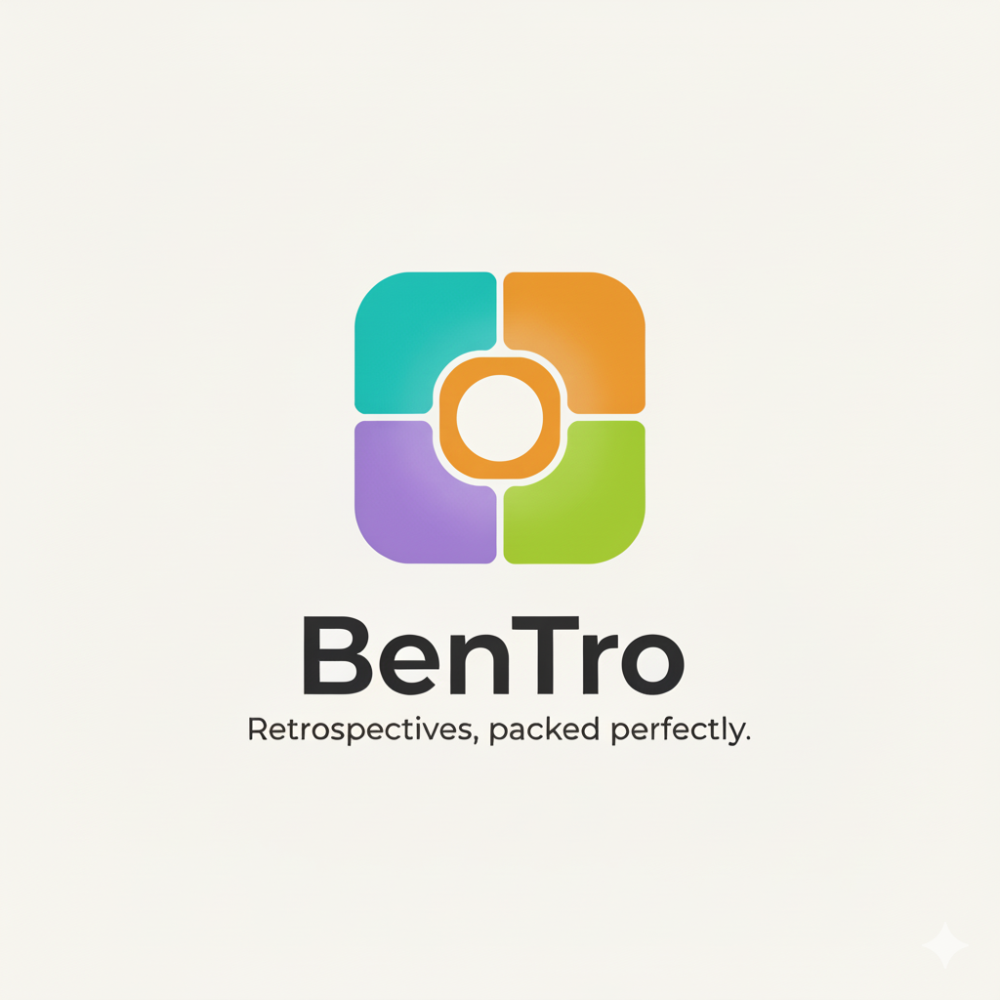

# BenTro - Future Features Roadmap

## 🎯 Vision
**BenTro** (Bento + Retrospective) - "Retrospectives, packed perfectly!"

A friendly, team-focused retrospective tool that makes collaboration effortless.

---

## 📋 Planned Features (Detailed Implementation Guide)

### Phase 1: Core UX Improvements (v0.2.0) ✅ IN PROGRESS

#### 1. Persistent User Identity
**Problem**: User name is lost on page refresh  
**Solution**:
- Store username in `localStorage` (already implemented)
- On app load, check for existing username
- Show confirmation modal: "Welcome back, [Name]!"
- Options: Continue or Change Name

**Implementation**:
- Add `returningUserModal` to `index.html`
- Update `initApp()` in `app.js` to check localStorage
- Add `showReturningUserModal()` function
- Event listeners for Continue/Change buttons

---

#### 2. Edit Username
**Problem**: No way to fix typos after initial entry  
**Solution**:
- Add pencil icon (✏️) next to username in header
- Click to open user modal with current name pre-filled
- Update localStorage and UI on save

**Implementation**:
- Add `editUserBtn` to header in `index.html`
- Add `openEditUserModal()` function in `app.js`
- Pre-fill `userNameInput` with current username
- Update `updateUserDisplay()` after save

---

#### 3. Fix Emoji Display Bug
**Problem**: 🎯 emoji only visible when text is selected  
**Root Cause**: CSS `background-clip: text` on `.title` class affects emoji rendering  
**Solution**:
- Split title into separate elements
- Apply gradient only to text, not emoji

**Implementation**:
```html
<h1 class="title">🎯 <span class="title-gradient">BenTro</span></h1>
```
```css
.title {
    color: var(--text-primary);
}
.title-gradient {
    background: linear-gradient(135deg, var(--primary), var(--secondary));
    -webkit-background-clip: text;
    -webkit-text-fill-color: transparent;
}
```

---

#### 4. Help Panel / About
**Purpose**: Show BenTro origin story and quick start guide  
**Content**:
- "BenTro = Bento + Retrospective"
- Tagline: "Retrospectives, packed perfectly!"
- Quick start instructions
- Keyboard shortcuts (future)
- Version info

**Implementation**:
- Add `helpModal` to `index.html`
- Add "?" button to header
- Style with `.help-content` class
- Event listener to open modal

---

#### 5. CSV Export
**Purpose**: Export retrospective data for analysis/archiving  
**Format**: CSV with columns: Column Name, Card Content, Likes, Dislikes, Merged Cards Count  
**Implementation**:
- Add `exportBoardToCSV()` function in `app.js`
- Iterate through columns and cards
- Format as CSV with proper escaping
- Trigger browser download
- Filename: `[BoardName]_[Date].csv`

**Code Snippet**:
```javascript
async function exportBoardToCSV(boardId) {
    const board = await apiCall(`/boards/${boardId}`);
    const rows = [['Column', 'Card Content', 'Likes', 'Dislikes', 'Merged Cards']];
    
    board.columns.forEach(column => {
        column.cards.filter(c => !c.merged_with_id).forEach(card => {
            rows.push([
                column.name,
                card.content,
                card.votes?.filter(v => v.vote_type === 'like').length || 0,
                card.votes?.filter(v => v.vote_type === 'dislike').length || 0,
                card.merged_cards?.length || 0
            ]);
        });
    });
    
    // Convert to CSV and download
}
```

---

### Phase 2: Multi-Team Support (v0.3.0)

#### 6. Team/Squad Management
**Purpose**: Allow multiple teams to use the app simultaneously  
**Database Changes**:
```sql
CREATE TABLE teams (
    id UUID PRIMARY KEY DEFAULT gen_random_uuid(),
    name VARCHAR(255) NOT NULL,
    created_at TIMESTAMP DEFAULT NOW()
);

CREATE TABLE user_teams (
    user_name VARCHAR(255) NOT NULL,
    team_id UUID REFERENCES teams(id) ON DELETE CASCADE,
    joined_at TIMESTAMP DEFAULT NOW(),
    PRIMARY KEY (user_name, team_id)
);

ALTER TABLE boards ADD COLUMN team_id UUID REFERENCES teams(id);
```

**UI Flow**:
1. After entering username, show team selection screen
2. Options:
   - Join existing team (dropdown)
   - Create new team (input field)
   - Continue without team (skip)
3. Store selected team in localStorage

**Implementation**:
- Backend: Add `team_handler.go` with CRUD operations
- Frontend: Add `teamSelectionModal` to `index.html`
- API endpoints: `/teams`, `/teams/:id`, `/teams/:id/join`
- Update dashboard to filter by team

---

#### 7. Team-Filtered Dashboard
**Logic**:
- If team selected: `GET /boards?team_id={teamId}`
- If no team: `GET /boards` (all boards)
- Empty state: "No boards yet. Create your first board!"

**Implementation**:
- Update `loadBoards()` to include team filter
- Add team selector dropdown in dashboard header
- Update `renderDashboard()` to show team context

---

#### 8. Admin Settings Page
**Route**: `/admin`  
**Access Control**: Admin-only (future: add user roles)  
**Settings**:
- Max columns per board (default: 6)
- Max cards per column (default: unlimited)
- Default timer duration (default: 5 minutes)
- Board retention policy (days before auto-archive)
- Team management (create/delete teams)

**Database**:
```sql
CREATE TABLE settings (
    key VARCHAR(255) PRIMARY KEY,
    value TEXT NOT NULL,
    updated_at TIMESTAMP DEFAULT NOW()
);
```

**Implementation**:
- Backend: `settings_handler.go` with GET/PUT endpoints
- Frontend: Admin page with form inputs
- Validation on backend for min/max values

---

### Phase 3: Internationalization & Polish (v0.4.0)

#### 9. Portuguese (pt-BR) Support
**Approach**: Lightweight client-side i18n  
**Structure**:
```
web/
  locales/
    en.json
    pt-BR.json
  i18n.js
```

**Translation Files**:
```json
// en.json
{
  "app.tagline": "Retrospectives, packed perfectly!",
  "phase.input": "Input Phase",
  "phase.voting": "Voting Phase",
  "button.addCard": "Add Card",
  "modal.welcome": "Welcome!"
}

// pt-BR.json
{
  "app.tagline": "Retrospectivas, perfeitamente organizadas!",
  "phase.input": "Fase de Entrada",
  "phase.voting": "Fase de Votação",
  "button.addCard": "Adicionar Cartão",
  "modal.welcome": "Bem-vindo!"
}
```

**Implementation**:
- Create `i18n.js` with `t(key)` function
- Load locale from localStorage or browser language
- Add language selector in header (🇺🇸 / 🇧🇷)
- Replace all hardcoded strings with `t('key')`

---

#### 10. Custom Logo Upload
**Purpose**: Allow branding customization  
**Implementation**:
- Admin page: File upload input
- Backend: Store in `/static/uploads/logo.png`
- Frontend: Check if custom logo exists, else show default emoji
- Update header to display logo

**Backend Endpoint**:
```go
func UploadLogo(c *gin.Context) {
    file, _ := c.FormFile("logo")
    c.SaveUploadedFile(file, "./web/static/uploads/logo.png")
    c.JSON(200, gin.H{"message": "Logo uploaded"})
}
```

**Frontend**:
```html

<span id="defaultEmoji" style="display:none;">🎯</span>
```

---

### Phase 4: Advanced Features (v0.5.0+)

#### 11. Card Templates
**Purpose**: Quick-start with common retrospective formats  
**Templates**:
- Start, Stop, Continue
- Mad, Sad, Glad
- 4Ls: Liked, Learned, Lacked, Longed For
- Sailboat: Wind, Anchor, Rocks, Island

**Implementation**:
- Add template selector in "Create Board" modal
- Pre-populate columns based on selection
- Store templates in `web/templates.json`

---

#### 12. Action Items Tracking
**Purpose**: Track follow-up tasks from retrospectives  
**Features**:
- Mark cards as "Action Items" (checkbox)
- Assign owner (dropdown of team members)
- Set due date
- Track completion status
- Dedicated "Action Items" view across all boards

**Database**:
```sql
ALTER TABLE cards ADD COLUMN is_action_item BOOLEAN DEFAULT FALSE;
ALTER TABLE cards ADD COLUMN assigned_to VARCHAR(255);
ALTER TABLE cards ADD COLUMN due_date DATE;
ALTER TABLE cards ADD COLUMN completed BOOLEAN DEFAULT FALSE;
```

**UI**:
- Add "⚡ Action Item" toggle in card modal
- Show action items with special badge
- Filter view: "Show only action items"

---

#### 13. Keyboard Shortcuts
**Shortcuts**:
- `N` - New card
- `V` - Switch to voting phase
- `T` - Start/stop timer
- `E` - Export CSV
- `Esc` - Close modal
- `?` - Show help panel

**Implementation**:
- Add global `keydown` event listener
- Check for modifier keys (Ctrl, Alt)
- Prevent conflicts with input fields
- Display shortcuts in help panel

---

#### 14. Card Reactions (Beyond Votes)
**Purpose**: More expressive feedback than 👍/👎  
**Reactions**: ❤️ (Love), 🎉 (Celebrate), 💡 (Idea), 🚀 (Action), 🤔 (Question)  
**Implementation**:
- Add reaction picker below card
- Store in database: `card_reactions` table
- Display reaction counts
- Allow one reaction per user per card

---

#### 15. Anonymous Mode
**Purpose**: Encourage honest feedback  
**Toggle**: Board-level setting  
**Effect**:
- Hide usernames on cards
- Show "Anonymous" instead
- Votes still tracked but not displayed by user

**Implementation**:
- Add `anonymous_mode` boolean to `boards` table
- Update `createCardHTML()` to check board setting
- Hide username in card footer if enabled

---

#### 16. Timer Sound Notifications
**Features**:
- Play sound when timer ends
- Browser notification permission
- Customizable alert sound (dropdown)
- Volume control

**Implementation**:
- Add audio files to `/static/sounds/`
- Use Web Audio API
- Request notification permission on first use
- Settings stored in localStorage

---

#### 17. Dark/Light Theme Toggle
**Current**: Dark theme only  
**Addition**: Light theme option  
**Implementation**:
- Duplicate CSS variables for light theme
- Add toggle button in header (🌙/☀️)
- Store preference in localStorage
- Respect `prefers-color-scheme` media query

**CSS**:
```css
[data-theme="light"] {
    --bg-dark: hsl(0, 0%, 98%);
    --text-primary: hsl(0, 0%, 10%);
    /* ... */
}
```

---

## 🗄️ Database Recommendation

**Current**: PostgreSQL  
**Alternatives Considered**:
- SQLite (simpler, single file)
- CockroachDB (distributed, PostgreSQL-compatible)

**Decision**: **Keep PostgreSQL**  
**Reasons**:
1. Proven reliability and maturity
2. Excellent GORM support
3. Scales well for multi-team usage
4. Rich ecosystem (pgAdmin, extensions)
5. JSONB support for flexible data
6. Full-text search capabilities

---

## 🧹 Repository Cleanup Checklist

- [ ] Remove `retro-app.exe` (add to `.gitignore`)
- [ ] Remove `setup_wsl_env.sh` (move to docs)
- [ ] Add comprehensive `.gitignore`:
  ```
  *.exe
  *.dll
  *.so
  *.dylib
  .env
  /uploads/
  /node_modules/
  .DS_Store
  ```
- [ ] Organize assets into `/web/static/assets/`
- [ ] Move logo files to `/web/static/assets/images/`
- [ ] Create `/docs/` folder for deployment guides

---

## 📚 Enhanced README Structure

```markdown
# BenTro 🎯



**Retrospectives, packed perfectly!**

## About
BenTro (Bento + Retrospective) is a friendly retrospective tool...

## Features
- Real-time collaboration
- Drag-and-drop cards
- Voting system
- Card merging
- CSV export
- Multi-team support (coming soon)

## Quick Start
### Docker
```bash
docker run -p 8080:8080 dnlouko/retro-app:latest
```

### Local Development
```bash
go run cmd/server/main.go
```

## Configuration
Environment variables...

## Contributing
We welcome contributions!...

## License
MIT License
```

---

## 🚀 Release Schedule

- **v0.2.0** (Current): Core UX + CSV Export
- **v0.3.0** (Q1 2025): Multi-Team Support
- **v0.4.0** (Q2 2025): i18n + Polish
- **v0.5.0** (Q3 2025): Advanced Features

---

**This document will be updated as features are implemented and new ideas emerge!** 🎉
